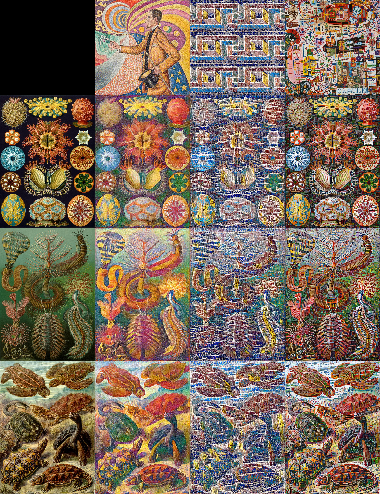
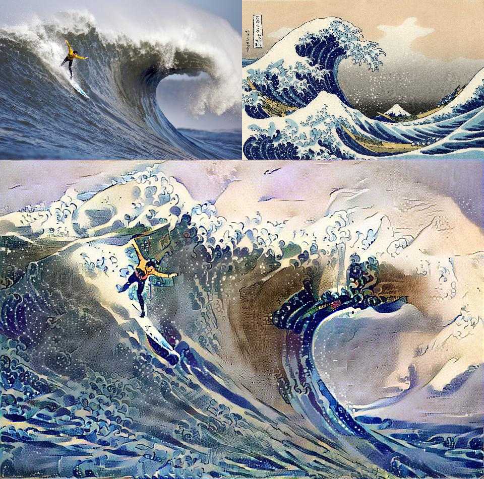

# Note: npy file in vgg_conv.npy.zip in case the box link ever goes down.

## TODO
- [ ] README
- ~~Google bucket to upload to Imgur Note: couldn't figure out how to upload file objects to Imgur~~ Figured out
- [X] Imgur create gallery to store input
- [ ] Create frontend rather than Flask restplus
- [ ] Style all the pages
- [ ] Feedback form with star rating and description
- [ ] Separate pages explaining how it works, link to repo, etc
- [X] Output
- [X] Hook into React gallery
- [ ] Calculate estimated time based on tf loss
- [ ] Email user when output is finished
- [X] Make separate Imgur account
- [ ] Hook up Imgur account to app
- [ ] Check to see if requirements.txt works. Used pipreqs to get a cleaner file

Below is Vince's original README explaining how this version of style transfer works

---

### Style Transfer as Optimal Transport 

### An algorithm that transfers the distribution of visual characteristics, or *style*, of a reference image onto a subject image via an Optimal Transport plan. 





### How it Works:

* For a general description and pictures: [style-transfer-theory.pdf](style-transfer-theory.pdf). 
* For an explanation of the use of L2-Wasserstein distance instead of the loss function from the [Gatys et. al](https://arxiv.org/abs/1508.06576) framework see [why_wasserstein.ipynb](why_wasserstein.ipynb). 
* [Demo video](https://vimeo.com/284207984)


tl;dr - Passes a subject and style image through the convolution layers of the vgg19 network. Extracts probabalistic descriptions (first two moments) of the convolution filter activations. Calculates L2-Wasserstein distance between these probability distributions and then modifies the subject image optimally to minimize this distance.  


### Running

Requires:
 1. Python 3 (w/ NumPy and PIL)
 2. Tensorflow (tested w/ version 1.3)
 3. 'vgg_conv.npy' binary (115.5 MB) which contains calibrated convolution filters from vgg19 network. Can be [downloaded here](https://app.box.com/v/vgg19-conv-npy) [md5sum: bf8a930fec201a0a2ade13d3f7274d0e]

Basic Usage from Command Line:

```
python basic_styletrans.py --subject media/wave_small.jpg --style media/kngwa_small.jpg --output media/wave_kngwa.jpg --vggnet vgg_conv.npy
```
Output:
```
loss: 118,500,040.00
ALL DONE 
post clip | time: 49.0 final loss: 2,771,486.50
synthesized image saved: media/wave_kngwa.jpg
```


